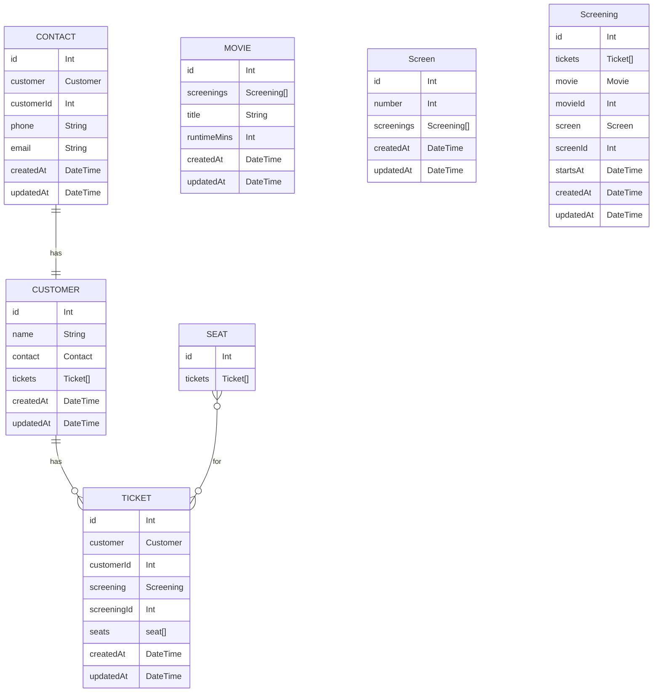

```mermaid
---
title
---
erDiagram

CUSTOMER {
  id  Int
  name  String
  contact Contact
  tickets Ticket[]
  createdAt DateTime
  updatedAt DateTime
}

CONTACT {
  id  Int
  customer  Customer
  customerId  Int
  phone String
  email String
  createdAt DateTime
  updatedAt DateTime
}

CONTACT ||--|| CUSTOMER: has

MOVIE {
  id  Int
  screenings  Screening[]
  title String
  runtimeMins Int
  createdAt DateTime
  updatedAt DateTime
}

Screen {
  id  Int
  number  Int
  screenings  Screening[]
  createdAt DateTime
  updatedAt DateTime
}

Screening {
  id  Int
  tickets Ticket[]
  movie Movie
  movieId Int
  screen  Screen
  screenId  Int
  startsAt  DateTime
  createdAt DateTime
  updatedAt DateTime
}

CUSTOMER ||--o{ TICKET: has

TICKET {
  id Int
  customer Customer
  customerId  Int
  screening Screening
  screeningId Int
  seats seat[]
  createdAt DateTime
  updatedAt DateTime
}

SEAT }o--o{ TICKET: for
SEAT {
  id Int
  tickets Ticket[]
}

```