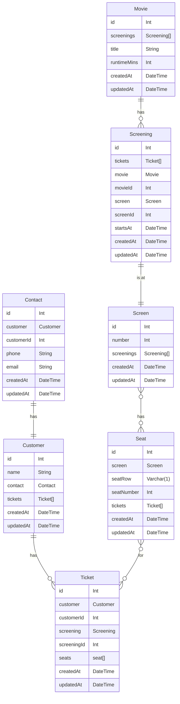

```mermaid
---
title
---
erDiagram

Customer {
  id  Int
  name  String
  contact Contact
  tickets Ticket[]
  createdAt DateTime
  updatedAt DateTime
}

Contact {
  id  Int
  customer  Customer
  customerId  Int
  phone String
  email String
  createdAt DateTime
  updatedAt DateTime
}

Contact ||--|| Customer: has

Movie {
  id  Int
  screenings  Screening[]
  title String
  runtimeMins Int
  createdAt DateTime
  updatedAt DateTime
}

Screen {
  id  Int
  number  Int
  screenings  Screening[]
  createdAt DateTime
  updatedAt DateTime
}

Movie ||--o{ Screening: has
Screening ||--|| Screen: "is at"
Screening {
  id  Int
  tickets Ticket[]
  movie Movie
  movieId Int
  screen  Screen
  screenId  Int
  startsAt  DateTime
  createdAt DateTime
  updatedAt DateTime
}

Customer ||--o{ Ticket: has

Ticket {
  id Int
  customer Customer
  customerId  Int
  screening Screening
  screeningId Int
  seats seat[]
  createdAt DateTime
  updatedAt DateTime
}

Seat }o--o{ Ticket: for
Screen }o--o{ Seat: has
Seat {
  id Int
  screen  Screen
  seatRow Varchar(1)
  seatNumber  Int
  tickets Ticket[]
  createdAt DateTime
  updatedAt DateTime
}
```